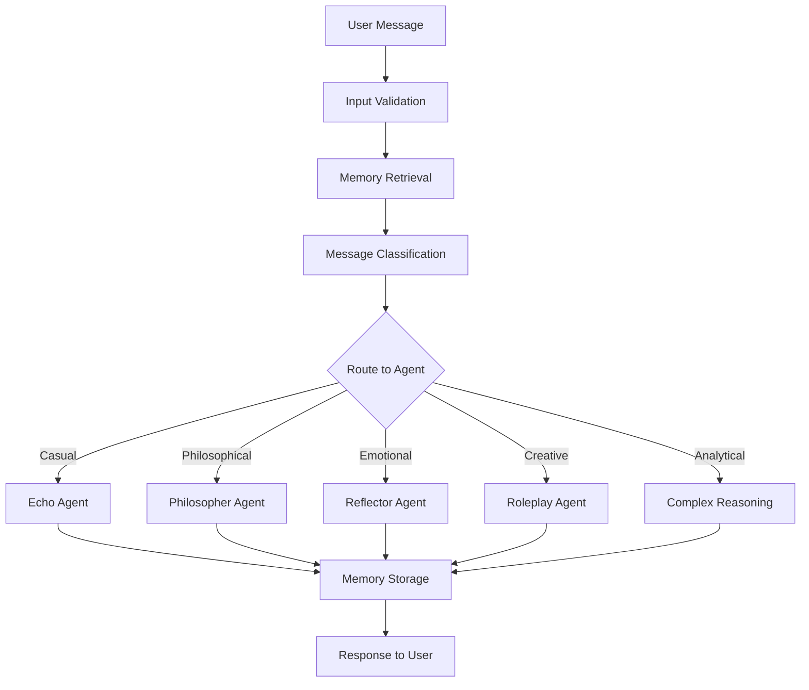

# EchoStar AI Simulator - Product Requirements Document (PRD)

## 📋 Document Information

| Field                | Value                 |
| -------------------- | --------------------- |
| **Product Name**     | EchoStar AI Simulator |
| **Version**          | 2.0                   |
| **Document Version** | 1.0                   |
| **Last Updated**     | July 2025             |
| **Owner**            | Development Team      |
| **Status**           | Active Development    |

---

## 🎯 Executive Summary

EchoStar is an advanced AI simulator designed to provide emotionally intelligent, contextually aware conversations through a sophisticated multi-persona agent system. The platform combines cutting-edge AI technology with hierarchical memory management to create meaningful, personalized interactions that adapt and evolve based on user preferences and conversation history.

### Key Value Propositions

- **Emotional Intelligence**: AI that understands and responds to emotional context
- **Adaptive Personas**: Multiple specialized agent personalities for different conversation types
- **Persistent Memory**: Hierarchical memory system that learns and remembers user preferences
- **Configurable Behavior**: Extensive configuration system for customization
- **Production-Ready**: Enterprise-grade logging, monitoring, and type safety

---

## 🎭 Product Overview

### Vision Statement

To create the most emotionally intelligent and contextually aware AI conversation system that provides meaningful, personalized interactions while maintaining user well-being and safety.

### Mission Statement

EchoStar empowers users to have deep, meaningful conversations with AI that remembers, learns, and adapts to their unique communication style and emotional needs.

### Target Users

- **Primary**: Individuals seeking meaningful AI conversations (focus: "Lily")
- **Secondary**: Researchers studying AI-human interaction patterns
- **Tertiary**: Developers building conversational AI applications

---

## 🏗️ System Architecture

### Core Components

#### 1. **Multi-Persona Agent System**

- **Echo Agent**: Handles casual, ambient conversations
- **Philosopher Agent**: Engages in deep philosophical discussions
- **Reflector Agent**: Provides emotional support and introspection
- **Roleplay Agent**: Manages creative and imaginative scenarios
- **Complex Reasoning Agent**: Handles analytical and problem-solving tasks

#### 2. **Hierarchical Memory System**

- **Episodic Memory**: Conversation history and specific interactions
- **Semantic Memory**: User preferences, facts, traits, and goals
- **Procedural Memory**: Learned behaviors and adaptive rules
- **User Profiles**: Comprehensive user personality and preference models

#### 3. **Intelligent Routing System**

- **Message Classification**: Automatic routing to appropriate agent persona
- **Context Analysis**: Understanding conversation flow and emotional state
- **Fallback Handling**: Graceful degradation for unclassified inputs

#### 4. **Configuration Management**

- **Environment-Based Config**: Development, staging, production configurations
- **Runtime Overrides**: Environment variable support for deployment flexibility
- **Type-Safe Models**: Pydantic-based configuration validation

#### 5. **Observability & Monitoring**

- **Structured Logging**: JSON-formatted logs with contextual information
- **Performance Monitoring**: Built-in timing and performance metrics
- **Error Tracking**: Comprehensive error handling and reporting

---

## ✨ Key Features

### 🤖 **Intelligent Agent Behaviors**

#### Echo Agent

- **Purpose**: Casual, friendly conversations
- **Triggers**: Greetings, simple questions, ambient chat
- **Characteristics**: Warm, approachable, concise responses
- **Use Cases**: Daily check-ins, light conversation, mood lifting

#### Philosopher Agent

- **Purpose**: Deep philosophical exploration
- **Triggers**: Existential questions, meaning-of-life discussions
- **Characteristics**: Thoughtful, probing, intellectually stimulating
- **Use Cases**: Life philosophy, ethical dilemmas, abstract thinking

#### Reflector Agent

- **Purpose**: Emotional support and introspection
- **Triggers**: Emotional vulnerability, personal struggles
- **Characteristics**: Empathetic, supportive, non-judgmental
- **Use Cases**: Mental health support, emotional processing, self-reflection
- **Special Mode**: Reflective Inquiry - connects current emotions to past experiences

#### Roleplay Agent

- **Purpose**: Creative and imaginative scenarios
- **Triggers**: "Let's pretend", creative storytelling requests
- **Characteristics**: Playful, creative, immersive
- **Use Cases**: Creative writing, fantasy scenarios, entertainment
- **Safety Feature**: Built-in threshold system to prevent excessive roleplay

#### Complex Reasoning Agent

- **Purpose**: Analytical problem-solving
- **Triggers**: Multi-step problems, analysis requests
- **Characteristics**: Methodical, structured, comprehensive
- **Use Cases**: Problem-solving, planning, analytical tasks
- **Process**: Uses scratchpad for step-by-step reasoning

### 🧠 **Advanced Memory System**

#### Memory Condensation

- **Automatic Summarization**: Converts detailed conversations into higher-level insights
- **Configurable Triggers**: Based on conversation turn count (default: every 10 turns)
- **Hierarchical Storage**: Maintains both detailed and summarized memory layers

#### Memory Retrieval

- **Intelligent Classification**: Determines optimal memory search strategy
- **Context-Aware Search**: Retrieves relevant memories based on current conversation
- **Performance Optimized**: Configurable search limits and caching

#### Procedural Learning

- **Behavioral Adaptation**: Learns from user feedback to modify responses
- **Agent-Specific Rules**: Can target specific personas or apply globally
- **Success Tracking**: Monitors effectiveness of learned behaviors

### 🔧 **Configuration & Customization**

#### Memory Configuration

```yaml
memory:
  turns_to_summarize: 10 # Condensation frequency
  search_limit: 10 # Max memories per search
  enable_condensation: true # Auto-summarization toggle
  procedural_search_limit: 5 # Behavioral rule limit
```

#### Routing Configuration

```yaml
routing:
  roleplay_threshold: 2 # Max consecutive roleplay sessions
  enable_fallback: true # Fallback response system
  classification_confidence_threshold: 0.8
```

#### LLM Configuration

```yaml
llm:
  model_name: "openai:gpt-4.1-mini"
  temperature: 0.7 # Response creativity
  max_tokens: null # Response length limit
  timeout: 30 # API timeout
```

#### Logging Configuration

```yaml
logging:
  level: "INFO" # Log verbosity
  format: "json" # Structured logging
  enable_file_logging: true # File output
  enable_performance_logging: false
```

### 🛡️ **Safety & Well-being Features**

#### Roleplay Threshold System

- **Purpose**: Prevents excessive escapism through roleplay
- **Mechanism**: Tracks consecutive roleplay sessions
- **Intervention**: Gentle redirection to real-world topics
- **Customizable**: Configurable threshold levels

#### Input Validation

- **Content Filtering**: Validates message content and length
- **Malicious Input Detection**: Protects against injection attacks
- **Error Handling**: Graceful handling of invalid inputs

#### Emotional Well-being

- **Mood Lift Tool**: Provides supportive interventions when needed
- **Context Awareness**: Recognizes emotional distress patterns
- **Professional Boundaries**: Maintains appropriate AI-human relationship

---

## 🎨 User Experience

### Conversation Flow



### User Interface

- **Platform**: Streamlit web application
- **Design**: Clean, conversational interface
- **Features**:
  - Real-time chat interface
  - Memory visualization (development mode)
  - Configuration display
  - Feedback submission system

### Personalization

- **Adaptive Responses**: AI learns user communication preferences
- **Memory Integration**: References past conversations naturally
- **Behavioral Learning**: Adjusts response style based on feedback
- **Context Continuity**: Maintains conversation context across sessions

---

## 🔧 Technical Requirements

### System Requirements

#### Runtime Environment

- **Python**: 3.11+
- **Memory**: 4GB RAM minimum, 8GB recommended
- **Storage**: 1GB for application, additional for persistent memory
- **Network**: Internet connection for LLM API calls

#### Dependencies

- **Core Framework**: LangChain, LangGraph, Streamlit
- **AI/ML**: OpenAI API, Pydantic for data validation
- **Storage**: InMemoryStore (current), Database integration (planned)
- **Monitoring**: Custom structured logging system and Langsmith
- **Testing**: pytest, mypy for type checking

#### Performance Requirements

- **Response Time**: < 3 seconds for standard responses
- **Memory Search**: < 500ms for memory retrieval
- **Concurrent Users**: Support for multiple simultaneous conversations
- **Uptime**: 99.9% availability target

### Security Requirements

- **API Key Management**: Secure storage of OpenAI API keys
- **Input Sanitization**: Protection against injection attacks
- **Data Privacy**: User conversation data protection
- **Access Control**: Authentication system for multi-user deployment

### Scalability Requirements

- **Database Integration**: Migration from InMemoryStore to persistent storage
- **Multi-user Support**: Isolated memory spaces per user
- **Load Balancing**: Horizontal scaling capability
- **Caching**: Intelligent memory and response caching

---

## 📊 Success Metrics

### User Engagement Metrics

- **Session Duration**: Average conversation length
- **Return Rate**: User retention and repeat usage
- **Satisfaction Score**: User feedback ratings
- **Feature Usage**: Adoption of different agent personas

### Technical Performance Metrics

- **Response Time**: Average and 95th percentile response times
- **Error Rate**: System error frequency and types
- **Memory Effectiveness**: Quality of memory retrieval and usage
- **Classification Accuracy**: Routing system precision

### AI Quality Metrics

- **Routing Consistency**: Accuracy of message classification
- **Response Appropriateness**: Quality of agent responses
- **Persona Consistency**: Maintenance of agent characteristics
- **Memory Integration**: Effective use of conversation history

---

## 🗓️ Development Roadmap

### Phase 1: Core System (Completed)

- ✅ Multi-persona agent system
- ✅ Hierarchical memory management
- ✅ Configuration system
- ✅ Structured logging
- ✅ Type safety implementation

### Phase 2: Database Integration (In Progress)

- 🔄 Persistent storage implementation
- 🔄 Database schema design
- 🔄 Migration from InMemoryStore
- 🔄 Performance optimization

### Phase 3: Enhanced Features (Planned)

- 📋 Advanced memory analytics
- 📋 Multi-user support
- 📋 API endpoint development
- 📋 Mobile application support

### Phase 4: Enterprise Features (Future)

- 📋 Advanced security features
- 📋 Compliance and audit logging
- 📋 Custom model integration
- 📋 Enterprise deployment tools

---

## 🧪 Testing Strategy

### Test Categories

#### Unit Tests

- **Coverage**: Individual component testing
- **Focus**: Configuration, utilities, data models
- **Tools**: pytest, unittest.mock
- **Target**: 90% code coverage

#### Integration Tests

- **Coverage**: System component interaction
- **Focus**: Configuration integration, logging system, type checking
- **Tools**: pytest with real component testing
- **Target**: All critical paths covered

#### Evaluation Tests

- **Coverage**: AI agent behavior and quality
- **Focus**: Routing consistency, response quality, persona maintenance
- **Tools**: Custom evaluation framework
- **Target**: Behavioral regression prevention

#### Performance Tests

- **Coverage**: System performance under load
- **Focus**: Response times, memory usage, concurrent users
- **Tools**: Custom performance monitoring
- **Target**: Meet performance requirements

---

## 🚀 Deployment

### Environment Configuration

#### Development

- **Purpose**: Local development and testing
- **Configuration**: Debug logging, relaxed validation
- **Database**: InMemoryStore for rapid iteration
- **API Keys**: Development/test keys

#### Staging

- **Purpose**: Pre-production testing
- **Configuration**: Production-like settings with enhanced logging
- **Database**: Persistent storage with test data
- **API Keys**: Staging environment keys

#### Production

- **Purpose**: Live user deployment
- **Configuration**: Optimized performance settings
- **Database**: Production database with backups
- **API Keys**: Production API keys with rate limiting

### Infrastructure Requirements

- **Compute**: Container-based deployment (Docker)
- **Storage**: Persistent database (PostgreSQL/MongoDB)
- **Monitoring**: Application performance monitoring
- **Backup**: Automated data backup and recovery

---

## 🔒 Privacy & Compliance

### Data Handling

- **User Conversations**: Encrypted storage and transmission
- **Memory Data**: Secure persistent storage with access controls
- **API Communications**: TLS encryption for all external calls
- **Logging**: Sanitized logs without sensitive information

### Compliance Considerations

- **GDPR**: User data rights and deletion capabilities
- **CCPA**: California privacy law compliance
- **SOC 2**: Security and availability controls
- **HIPAA**: Healthcare information protection (if applicable)

---

## 📞 Support & Maintenance

### User Support

- **Documentation**: Comprehensive user guides and API documentation
- **Feedback System**: Built-in feedback collection and processing
- **Issue Tracking**: Systematic bug reporting and resolution
- **Community**: User community and knowledge base

### System Maintenance

- **Monitoring**: 24/7 system health monitoring
- **Updates**: Regular security and feature updates
- **Backup**: Automated backup and disaster recovery
- **Performance**: Continuous performance optimization

---

## 📈 Future Enhancements

### Advanced AI Features

- **Multi-modal Input**: Support for voice and image inputs
- **Emotional Recognition**: Advanced emotion detection and response
- **Personality Customization**: User-defined AI personality traits
- **Learning Acceleration**: Faster adaptation to user preferences

### Platform Expansion

- **Mobile Applications**: Native iOS and Android apps
- **Voice Interface**: Integration with voice assistants
- **API Platform**: Public API for third-party integrations
- **Enterprise Solutions**: B2B conversational AI platform

### Research & Development

- **Memory Optimization**: Advanced memory compression and retrieval
- **Behavioral Psychology**: Integration of psychological models
- **Ethical AI**: Enhanced safety and bias mitigation
- **Performance Research**: Cutting-edge optimization techniques

---

## 📝 Conclusion

EchoStar represents a significant advancement in conversational AI technology, combining sophisticated multi-persona agents with hierarchical memory management to create truly personalized and emotionally intelligent interactions. The system's modular architecture, comprehensive configuration system, and focus on user well-being position it as a leading platform for meaningful AI-human conversations.

The product's success will be measured not just by technical performance, but by its ability to create genuine value in users' lives through supportive, adaptive, and contextually aware conversations that respect both emotional needs and personal boundaries.

---

_This PRD serves as the foundational document for EchoStar development and will be updated as the product evolves and new requirements emerge._
