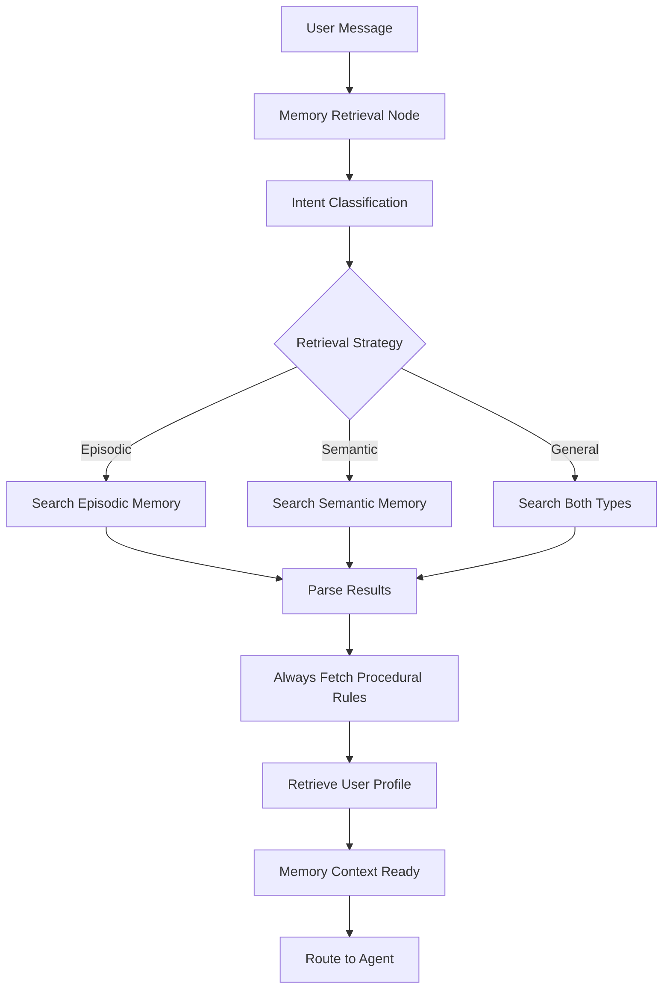
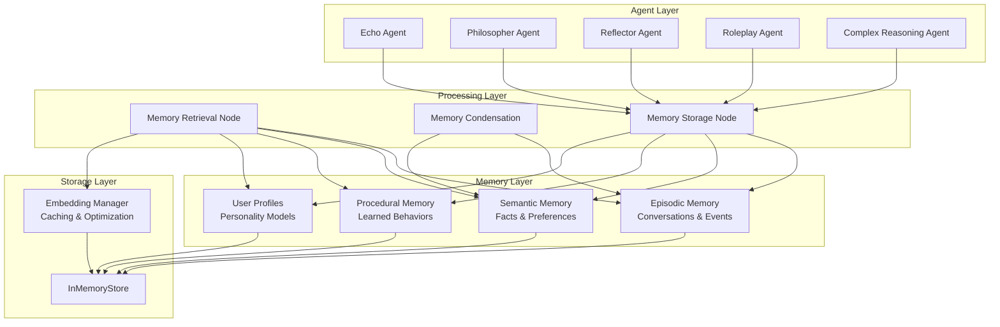

# EchoStar Memory System Documentation

## 📋 Overview

EchoStar implements a sophisticated hierarchical memory system that enables the AI to maintain context, learn from interactions, and provide personalized responses. This document provides a comprehensive guide to understanding and working with the memory architecture.

---

## 🧠 Memory Types

### 1. **Episodic Memory**

**Purpose**: Stores specific conversation interactions and temporal sequences

**Structure**:

```python
class EpisodicMemory(BaseModel):
    user_message: str      # User's input
    ai_response: str       # AI's response
    timestamp: str         # When the interaction occurred
    context: str          # Additional contextual information
```

**Storage Location**: `("echo_star", "Lily", "collection")` namespace

**Use Cases**:

- Remembering specific conversations
- Maintaining dialogue history
- Temporal context for responses
- Conversation flow continuity

**Example**:

```json
{
  "user_message": "I love swimming in the ocean",
  "ai_response": "That sounds wonderful! The ocean has such a calming energy...",
  "timestamp": "2025-07-16T14:30:00",
  "context": "User expressing personal preference"
}
```

### 2. **Semantic Memory**

**Purpose**: Stores factual knowledge, user preferences, and abstract concepts

**Structure**:

```python
class SemanticMemory(BaseModel):
    category: str         # Type of knowledge (preference, fact, trait)
    content: str          # The actual knowledge content
    context: str          # How this knowledge was acquired
    importance: float     # Relevance score (0.0-1.0)
    timestamp: str        # When this was learned
```

**Storage Location**: `("echo_star", "Lily", "facts")` namespace

**Use Cases**:

- User preferences and traits
- Factual information about the user
- Abstract concepts and relationships
- Long-term knowledge retention

**Example**:

```json
{
  "category": "preference",
  "content": "Lily prefers fish over cheese and enjoys swimming",
  "context": "Learned from multiple conversations about food and activities",
  "importance": 0.8,
  "timestamp": "2025-07-16T14:30:00"
}
```

### 3. **Procedural Memory**

**Purpose**: Stores learned behaviors and adaptive response rules

**Structure**:

```python
class ProceduralMemory(BaseModel):
    trigger: str          # What condition activates this rule
    action: str           # What behavior to execute
    target_agent: str     # Which agent this applies to ("all" or specific)
    success_rate: float   # How effective this rule has been
    timestamp: str        # When this rule was created
```

**Storage Location**: `("echo_star", "Lily", "procedures")` namespace

**Use Cases**:

- Behavioral adaptations based on user feedback
- Agent-specific response modifications
- Learned interaction patterns
- Dynamic response customization

**Example**:

```json
{
  "trigger": "user mentions feeling stuck",
  "action": "respond with 'I hear you BBLL' and offer grounding exercises",
  "target_agent": "reflector",
  "success_rate": 0.9,
  "timestamp": "2025-07-16T14:30:00"
}
```

### 4. **User Profiles**

**Purpose**: Comprehensive user personality and preference models

**Structure**:

```python
# Dynamic structure based on conversation analysis
{
  "name": "Lily",
  "preferences": {...},
  "personality_traits": {...},
  "communication_style": {...},
  "emotional_patterns": {...}
}
```

**Storage Location**: `("echo_star", "Lily", "profile")` namespace

**Use Cases**:

- Holistic user understanding
- Personalization foundation
- Cross-conversation continuity
- Behavioral prediction

---

## 🔄 Memory Routing & Access Design

### Memory Retrieval Flow



### Intelligent Classification System

The system uses an LLM-based classifier to determine optimal memory search strategy:

```python
class RetrievalClassifier(BaseModel):
    retrieval_type: Literal["episodic", "semantic", "general"]
```

**Classification Logic**:

- **Episodic**: When user references specific past events or conversations
- **Semantic**: When user asks about preferences, facts, or general knowledge
- **General**: For complex queries requiring both types of memory

### Conditional Memory Access

#### Agent-Specific Procedural Memory

Each agent can have targeted behavioral rules:

```python
@apply_procedural_memory(target_agent="reflector", limit=5)
def reflector_node(state, llm, profile, learned_instruction=None):
    # Agent receives learned instructions automatically
    final_instructions = learned_instruction or default_instructions
```

#### Dynamic Memory Selection

Memory search limits and strategies are configurable:

```yaml
memory:
  search_limit: 10 # Max memories per search
  procedural_search_limit: 5 # Max behavioral rules
  enable_condensation: true # Auto-summarization
  turns_to_summarize: 10 # Condensation frequency
```

---

## 🏗️ Architectural Overview

### High-Level Architecture



### Memory Condensation System

**Purpose**: Prevents memory bloat by summarizing old conversations

**Process**:

1. **Trigger**: Every N conversation turns (configurable, default: 10)
2. **Retrieval**: Fetch recent episodic memories
3. **Summarization**: LLM creates condensed summary
4. **Hybrid Storage**: Save summary to both semantic and episodic memory
5. **Cleanup**: Delete original detailed memories

**Benefits**:

- Maintains long-term context without storage bloat
- Preserves important information in condensed form
- Enables hierarchical memory retrieval

### Embedding Manager Optimization

**Features**:

- **Caching**: Reduces redundant API calls for similar queries
- **Batch Processing**: Optimizes multiple memory searches
- **Performance Monitoring**: Tracks cache hit rates and API usage

**Configuration**:

```python
embedding_manager = EmbeddingManager(
    cache_size=1000,    # Number of cached embeddings
    cache_ttl=3600      # Cache time-to-live in seconds
)
```

---

## 💡 Usage Examples

### Example 1: Basic Conversation Memory

**User Input**: "I mentioned I like swimming yesterday"

**Memory Retrieval**:

1. **Classification**: "episodic" (references past conversation)
2. **Search**: Episodic memory for swimming-related conversations
3. **Result**: Finds previous conversation about swimming preferences

**Agent Response**: "Yes, I remember you mentioning how much you enjoy swimming! You said the ocean has such a calming energy for you..."

### Example 2: Preference Learning

**Conversation Sequence**:

```
User: "I prefer tea over coffee"
AI: "I'll remember that you prefer tea. What kind of tea do you enjoy most?"
User: "Green tea is my favorite"
```

**Memory Storage**:

- **Episodic**: Stores the specific conversation
- **Semantic**: Extracts "Lily prefers tea over coffee, especially green tea"
- **Profile**: Updates user preferences section

**Future Reference**:

```
User: "I'm feeling tired"
AI: "Would you like to make some green tea? I remember that's your favorite."
```

### Example 3: Behavioral Learning

**Learning Scenario**:

```
User: "When I say I'm stuck, please respond with 'I hear you BBLL'"
AI: "I'll remember that. When you mention feeling stuck, I'll use that phrase."
```

**Procedural Memory Created**:

```json
{
  "trigger": "user mentions feeling stuck",
  "action": "respond with 'I hear you BBLL' and offer support",
  "target_agent": "reflector",
  "success_rate": 1.0
}
```

**Applied Behavior**:

```
User: "I feel stuck again"
AI: "I hear you BBLL. Feeling stuck without a clear reason can be really frustrating..."
```

### Example 4: Memory Condensation

**Before Condensation** (10 detailed conversations):

```
Episodic Memory: 10 individual conversation records
Semantic Memory: Scattered facts and preferences
```

**After Condensation**:

```
Episodic Memory:
- 1 condensed summary of 10 conversations
- Current conversation details

Semantic Memory:
- Same condensed summary for knowledge-based retrieval
- Preserved individual facts and preferences
```

**Condensed Summary Example**:

> "Lily prefers fish over cheese and enjoys swimming rather than running, reflecting a calm, flowing lifestyle. She embraces playful and regal roles in conversations, values empathetic acknowledgment when feeling stuck, and shows openness to grounding exercises and creative exploration."

### Example 5: Multi-Agent Memory Usage

**Scenario**: User switches between different conversation types

**Echo Agent** (casual chat):

- Accesses recent episodic memories for context
- Uses semantic memory for personalization
- Applies general procedural rules

**Reflector Agent** (emotional support):

- Prioritizes emotional context from episodic memory
- Uses reflector-specific procedural rules
- References user's emotional patterns from profile

**Philosopher Agent** (deep discussions):

- Accesses semantic memory for user's philosophical interests
- Uses episodic memory for conversation continuity
- Applies philosopher-specific behavioral adaptations

**Complex Reasoning Agent** (analytical tasks):

- **Planner Node**: Uses all memory types to create comprehensive analysis plans
  - Episodic memory for conversation context
  - Semantic memory for user preferences and knowledge
  - User profile for personalized planning approach
- **Executor Node**: References the scratchpad plan and memory context to provide detailed responses
- **Memory Integration**: Combines analytical thinking with personal context

**Roleplay Agent** (creative scenarios):

- Accesses episodic memory for roleplay history and preferences
- Uses semantic memory for character preferences and creative interests
- **Safety Mechanism**: Rule-based threshold system with memory tracking
  - Tracks `roleplay_count` in conversation state
  - Configurable threshold (default: 2 consecutive sessions)
  - **Mood Lift Tool Integration**: When threshold exceeded:
    ```python
    intervention_message = mood_lift_tool.invoke({
        "user_id": profile["name"],
        "issue": "User has initiated roleplay more than the set threshold."
    })
    ```
  - Gentle redirection: "I hear your desire to step into another world... However, I'm noticing we're spending a lot of time here. {intervention_message} Let's try something different for now."

### Example 6: Complex Reasoning Memory Integration

**User Input**: "Can you analyze my emotional patterns based on our conversations?"

**Complex Reasoning Process**:

**Planner Node** (creates analysis strategy):

```
Memory Context Used:
- Episodic Memory: Recent emotional expressions and conversations
- Semantic Memory: Known emotional patterns and preferences
- User Profile: Personality traits and communication style
- Procedural Memory: Any learned emotional support behaviors

Generated Plan:
1. Review episodic memories for emotional expressions
2. Identify patterns in semantic memory about emotional states
3. Cross-reference with user profile personality traits
4. Synthesize findings with empathetic framing
5. Provide actionable insights based on learned preferences
```

**Executor Node** (implements the plan):

```
Memory Integration:
- References specific conversations from episodic memory
- Uses semantic knowledge about user's emotional preferences
- Applies procedural rules for empathetic communication
- Personalizes response based on user profile data

Final Response: Comprehensive emotional analysis combining all memory types
```

**Memory Storage**: The analysis itself becomes new semantic memory about the user's emotional patterns, enriching future interactions.

---

## ⚙️ Configuration & Customization

### Memory Configuration Options

```yaml
memory:
  # Search and retrieval settings
  search_limit: 10 # Max memories per search
  procedural_search_limit: 5 # Max behavioral rules to apply

  # Condensation settings
  enable_condensation: true # Enable automatic summarization
  turns_to_summarize: 10 # Trigger condensation every N turns

  # Embedding optimization
  embedding_cache_size: 1000 # Number of cached embeddings
  embedding_cache_ttl: 3600 # Cache expiration time (seconds)

  # Storage settings
  max_episodic_memories: 1000 # Maximum episodic memories before cleanup
  max_semantic_memories: 500 # Maximum semantic memories
  importance_threshold: 0.3 # Minimum importance for memory retention
```

### Advanced Customization

#### Custom Memory Types

Extend the system with custom memory schemas:

```python
class CustomMemory(BaseModel):
    custom_field: str
    importance: float
    timestamp: str

    class Config:
        extra = "allow"  # Allow additional fields
```

#### Custom Retrieval Logic

Implement specialized memory retrieval:

```python
def custom_memory_search(query: str, memory_type: str) -> List[Any]:
    # Custom search implementation
    return filtered_memories
```

#### Behavioral Rule Templates

Create reusable procedural memory patterns:

```python
BEHAVIORAL_TEMPLATES = {
    "empathy_response": {
        "trigger": "user expresses {emotion}",
        "action": "acknowledge {emotion} and offer {support_type}",
        "target_agent": "reflector"
    }
}
```

---

## 🔧 Technical Implementation Details

### Memory Storage Format

All memories are stored in the InMemoryStore with this structure:

```python
store.put(
    namespace=("echo_star", "user_id", "memory_type"),
    key=unique_memory_id,
    value={
        "kind": "MemoryType",  # EpisodicMemory, SemanticMemory, etc.
        "content": memory_data_dict
    }
)
```

### Memory Parsing Pipeline

```python
def _parse_raw_memory(raw_results: List[Any], schema: Type[T]) -> List[T]:
    """
    Converts raw store results into typed memory objects
    """
    parsed_memories = []
    for doc in raw_results:
        # Extract content from store format
        content = doc['value']['content']
        # Validate and parse with Pydantic
        parsed_memories.append(schema(**content))
    return parsed_memories
```

### Error Handling & Fallbacks

The memory system includes comprehensive error handling:

- **Graceful Degradation**: Continues conversation even if memory operations fail
- **Fallback Behavior**: Uses default responses when memory is unavailable
- **Error Context**: Detailed logging for debugging and monitoring
- **Recovery Mechanisms**: Automatic retry and alternative strategies

---

## 📊 Performance & Monitoring

### Memory Performance Metrics

- **Retrieval Time**: Average time for memory searches
- **Cache Hit Rate**: Embedding cache effectiveness
- **Memory Usage**: Storage consumption tracking
- **Condensation Success**: Summary generation reliability

### Monitoring Tools

```python
# Get embedding cache statistics
cache_stats = get_embedding_cache_stats()
print(f"Cache hit rate: {cache_stats['hit_rate_percent']}%")
print(f"API calls saved: {cache_stats['api_calls_saved']}")

# Clear cache if needed
clear_embedding_cache()
```

### Performance Optimization Tips

1. **Tune Search Limits**: Balance context richness with response time
2. **Optimize Condensation Frequency**: More frequent = less storage, more processing
3. **Monitor Cache Performance**: Adjust cache size based on usage patterns
4. **Profile Memory Usage**: Identify and optimize memory-intensive operations

---

## 🚀 Best Practices

### Memory Design Principles

1. **Hierarchical Organization**: Use appropriate memory types for different information
2. **Importance Weighting**: Prioritize critical information with higher importance scores
3. **Temporal Awareness**: Consider recency and relevance in memory retrieval
4. **Agent Specificity**: Tailor procedural memories to specific agent behaviors

### Development Guidelines

1. **Validate Memory Data**: Always use Pydantic models for type safety
2. **Handle Errors Gracefully**: Implement fallbacks for memory operations
3. **Monitor Performance**: Track memory system metrics in production
4. **Test Memory Scenarios**: Include memory-specific test cases

### Deployment Considerations

1. **Storage Scaling**: Plan for memory growth over time
2. **Backup Strategies**: Implement memory data backup and recovery
3. **Privacy Compliance**: Ensure memory data handling meets privacy requirements
4. **Performance Monitoring**: Set up alerts for memory system health

---

## 🔮 Future Enhancements

### Planned Features

- **Vector Database Integration**: Enhanced semantic search capabilities
- **Memory Analytics**: Detailed insights into memory usage patterns
- **Multi-User Isolation**: Separate memory spaces for different users
- **Memory Export/Import**: Backup and migration capabilities

### Research Directions

- **Adaptive Memory Retention**: AI-driven memory importance scoring
- **Cross-Conversation Learning**: Insights from multiple user interactions
- **Memory Compression**: Advanced techniques for efficient storage
- **Emotional Memory Modeling**: Specialized handling of emotional context

---

## 📚 Additional Resources

### Related Documentation

- [Configuration Guide](../config/README.md)
- [Agent System Overview](../src/agents/README.md)
- [API Reference](../docs/api.md)

### Code Examples

- [Memory Usage Examples](../examples/memory_examples.py)
- [Custom Memory Types](../examples/custom_memory.py)
- [Performance Optimization](../examples/memory_optimization.py)

---

_This documentation is maintained alongside the EchoStar codebase and updated as the memory system evolves._
